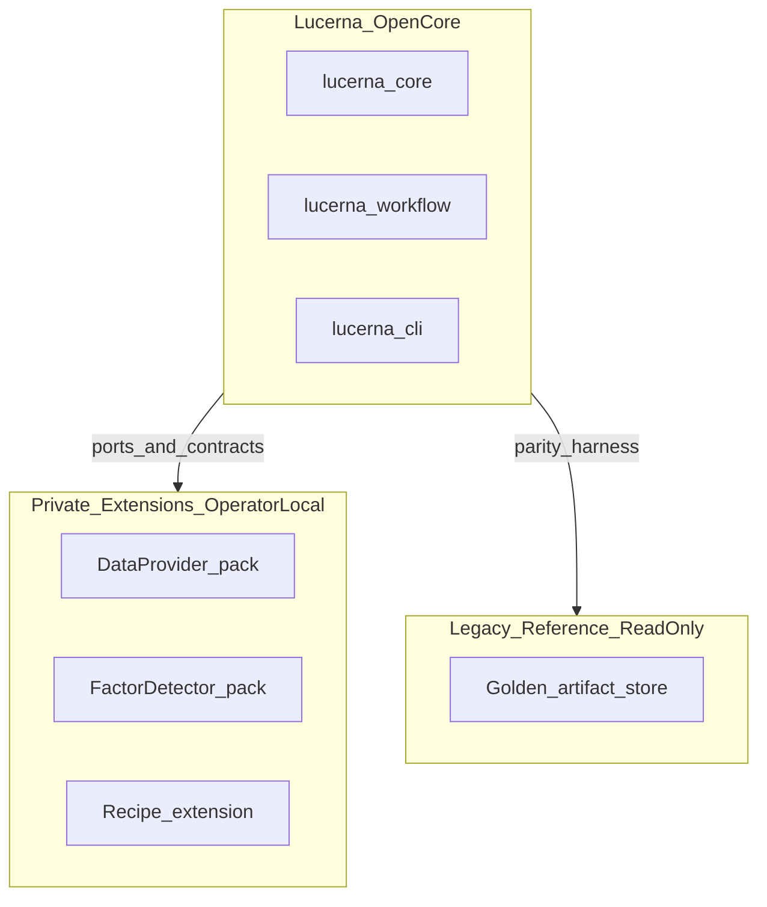
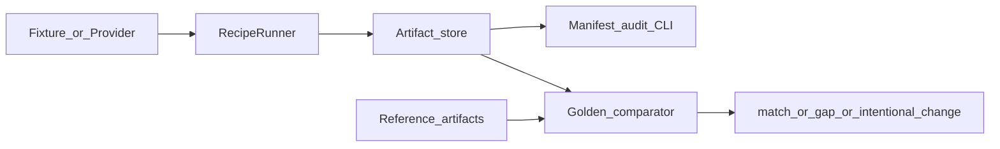
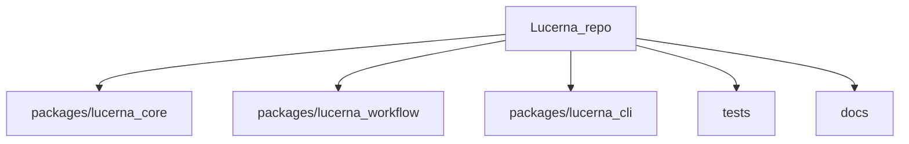

# Lucerna

**Contract-first open core for evidence-first financial research workflows.**

Licensed under [Apache License 2.0](LICENSE). **v1.0.0 signed** — open-core semantics frozen at v0.11.0; see [RELEASE_NOTES.md](RELEASE_NOTES.md).

> Lucerna produces **research audit artifacts** and parity evidence. It is **not investment advice**, **not a trading system**, and **not a broker execution platform**. Default workflows use **synthetic fixtures only**.

## What Lucerna is

- A **port-and-contract** workspace for daily research workflows: recipes, artifact stores, manifest audit, and golden parity.
- An **open-core + private extension** model: OSS ships ports, schemas, demo fixtures, and harnesses; operators plug in private data, factors, and recipes locally.
- A **migration harness** against a frozen legacy reference (`indiciumgrid-golden-v1`) — preserves behavior where golden-covered, not module structure.

## What Lucerna is not

- Not live trading, order routing, or portfolio management.
- Not a substitute for compliance, disclosure, or investment research opinions.
- Not a full drop-in replacement for every legacy workflow surface (see [docs/V1_0_DEFINITION.md](docs/V1_0_DEFINITION.md)).

## Who it is for

| Audience | Use case |
| --- | --- |
| Quant / research engineers | Run reproducible workflow chains and audit artifact completeness |
| Workflow authors | Wire custom recipes and extension packs behind stable ports |
| Extension authors | Build private data, factor, and recipe packs without forking core contracts |
| Migration operators | Compare new outputs against legacy golden artifacts via parity harness |

## 30-second Quickstart

Requirements: Python 3.10+.

```bash
cd <repo-root>
python -m pip install -e packages/lucerna-core -e packages/lucerna-workflow -e packages/lucerna-cli -e ".[dev]"
lucerna --help
lucerna workflow synthetic-e2e \
  --trade-date 2026-06-23 \
  --artifact-root /tmp/lucerna-demo \
  --daily-review-fixture tests/fixtures/market_awareness/theme_sectors_demo.yaml \
  --preopen-review-fixture tests/fixtures/workflow/preopen_buy_point_review_demo.csv
lucerna parity run \
  --parity-config tests/fixtures/parity_reference_demo/parity_config_demo.yaml \
  --artifact-root /tmp/lucerna-parity-demo
```

On Windows, use a writable temp directory (for example `%TEMP%\lucerna-demo`).

## Architecture

### System boundary



### Runtime data flow



### Package workspace



Deeper diagrams: [docs/SYSTEM_MAP.md](docs/SYSTEM_MAP.md), [docs/diagrams/context.md](docs/diagrams/context.md).

## v1.0 capability matrix

| Capability | Status | Notes |
| --- | --- | --- |
| Market-gate decision kernel | `implemented_v1` | Golden-tested strict/observation/active_watch semantics |
| Artifact store + golden compare | `implemented_v1` | Local I/O, semantic comparator, five scenarios |
| Artifact manifest / audit CLI | `implemented_v0.4.1` | `lucerna artifact list/audit` |
| Data provider ports v1 + v2 | `implemented_v1` / `implemented_v0.9` | Fixtures in OSS; live adapters in private packs |
| Factor detector port + pack loading | `implemented_v0.3` / `implemented_v0.7` | Demo detectors only in OSS |
| Workflow chain + recipe integration | `implemented_v0.6` / `implemented_v0.10` | `--recipe` + extension pack wiring |
| Private-local parity harness | `implemented_v0.11` | `lucerna parity run` — research audit only |
| Open-core sign-off | `signed_v1.0` | Gaps accepted in private register |

Full matrix: [CAPABILITY_REGISTER.md](CAPABILITY_REGISTER.md).

## Open core vs private extensions

**In this repository:** ports, schemas, artifact contracts, synthetic fixtures, demo implementations, CLI, parity harness, and governance docs.

**Operator-local (not in OSS):** real market data adapters, proprietary factor detectors, production A-share recipe logic, account evidence, and legacy `output/` trees.

To build your own extensions, start at [docs/EXTENSION_AUTHOR_GUIDE.md](docs/EXTENSION_AUTHOR_GUIDE.md) and [examples/private_extension_template/](examples/private_extension_template/).

## Documentation

| Topic | Path |
| --- | --- |
| Release history | [RELEASE_NOTES.md](RELEASE_NOTES.md) |
| Migration roadmap | [docs/MIGRATION_ROADMAP.md](docs/MIGRATION_ROADMAP.md) |
| v1.0 definition | [docs/V1_0_DEFINITION.md](docs/V1_0_DEFINITION.md) |
| Extension author guide | [docs/EXTENSION_AUTHOR_GUIDE.md](docs/EXTENSION_AUTHOR_GUIDE.md) |
| Agent onboarding | [docs/AGENT_QUICKSTART.md](docs/AGENT_QUICKSTART.md) |
| System map | [docs/SYSTEM_MAP.md](docs/SYSTEM_MAP.md) |
| Constitution + ADRs | [LUCERNA_CONSTITUTION.md](LUCERNA_CONSTITUTION.md), [docs/decisions/](docs/decisions/) |
| Security | [SECURITY.md](SECURITY.md) |

For AI agents: start at [docs/AGENT_QUICKSTART.md](docs/AGENT_QUICKSTART.md) (rules in [AGENTS.md](AGENTS.md)).

## Install

```bash
cd <repo-root>
python -m pip install -e packages/lucerna-core
python -m pip install -e packages/lucerna-workflow
python -m pip install -e packages/lucerna-cli
python -m pip install -e ".[dev]"
```

The CLI entry point is `lucerna` (from `lucerna-cli`).

Golden export (optional, needs a local frozen reference checkout):

```bash
python scripts/export_golden_market_gate.py
```

## Test

```bash
cd <repo-root>
python -m pytest -q
python -m ruff check .
```

On Windows, if pytest fails with Temp/.pytest_cache permission errors:

```powershell
python -m pytest -p no:cacheprovider -q --basetemp "$env:TEMP\lucerna_pytest\pytest-basetemp-<unique>"
```

| Layer | Path | Purpose |
| --- | --- | --- |
| Golden | `tests/golden/` | Semantic parity vs exported reference artifacts (5 market-gate scenarios) |
| Contract | `tests/contract/` | Artifact store, provider, factor detectors, daily-review skeleton |
| Fixtures | `tests/fixtures/` | Synthetic OHLCV, recipes, parity demo trees |
| CLI smoke | `tests/cli/` | Typer help + workflow/artifact/parity commands |

## CLI reference

```powershell
lucerna --help
lucerna workflow market-gate --trade-date 2026-06-23 --artifact-root <artifact-root>
lucerna workflow chain --trade-date 2026-06-23 --artifact-root <artifact-root> \
  --daily-review-fixture tests/fixtures/market_awareness/theme_sectors_demo.yaml \
  --post-close-review-fixture tests/fixtures/workflow/post_close_buy_point_review_demo.csv \
  --preopen-review-fixture tests/fixtures/workflow/preopen_buy_point_review_demo.csv
lucerna artifact audit --artifact-root <artifact-root> --trade-date 2026-06-23 --stage-type market_gate
lucerna parity run --parity-config tests/fixtures/parity_reference_demo/parity_config_demo.yaml --artifact-root <artifact-root>
```

`artifact audit` checks structural completeness (required files, schema IDs, trade_date consistency). Semantic parity remains the golden comparator's job.

Expected inputs under `--artifact-root`:

```text
artifact-root/
  workflows/{YYYYMMDD}/preopen/buy_point_review_internal.csv
  market_awareness/{YYYYMMDD}/daily_review/theme_state_ranking.csv
```

Outputs: `artifact-root/workflows/{YYYYMMDD}/market_gate/` (strict, observation, active_watch, rejected, calibration, summary, state).

## Extended Quickstart

Full command walkthrough (chain, factor scan, recipe, provider):

```bash
lucerna workflow chain \
  --trade-date 2026-06-23 \
  --artifact-root /tmp/lucerna-chain \
  --daily-review-fixture tests/fixtures/market_awareness/theme_sectors_demo.yaml \
  --post-close-review-fixture tests/fixtures/workflow/post_close_buy_point_review_demo.csv \
  --preopen-review-fixture tests/fixtures/workflow/preopen_buy_point_review_demo.csv

lucerna factor scan \
  --trade-date 2026-05-10 \
  --artifact-root /tmp/lucerna-factor \
  --ohlcv-fixture-root tests/fixtures/ohlcv \
  --asset-fixture-list tests/fixtures/factor_scan_assets.yaml \
  --factor-pack tests/fixtures/factor_pack_demo.yaml

lucerna workflow chain \
  --trade-date 2026-06-23 \
  --artifact-root /tmp/lucerna-recipe \
  --recipe tests/fixtures/workflow/recipe_ashare_daily_v1.yaml \
  --recipe-extension-pack tests/fixtures/recipe_extension_pack_demo.yaml \
  --daily-review-fixture tests/fixtures/market_awareness/theme_sectors_demo.yaml

lucerna provider inspect --ohlcv-fixture-root tests/fixtures/ohlcv
```

## Packages

| Package | Role |
| --- | --- |
| `lucerna-core` | Domain, labels, ports, artifacts, providers, recipes, parity |
| `lucerna-workflow` | `market_gate` kernel; daily-review; e2e; workflow chain |
| `lucerna-cli` | `workflow`, `artifact`, `factor`, `provider`, `parity` commands |

## Version boundaries

Per-release scope and non-goals are documented in [RELEASE_NOTES.md](RELEASE_NOTES.md) (condensed version history) and [CAPABILITY_REGISTER.md](CAPABILITY_REGISTER.md). Migration reconciliation: [docs/MIGRATION_ROADMAP.md](docs/MIGRATION_ROADMAP.md).

Reference pin:

```text
indiciumgrid @ indiciumgrid-golden-v1
```
