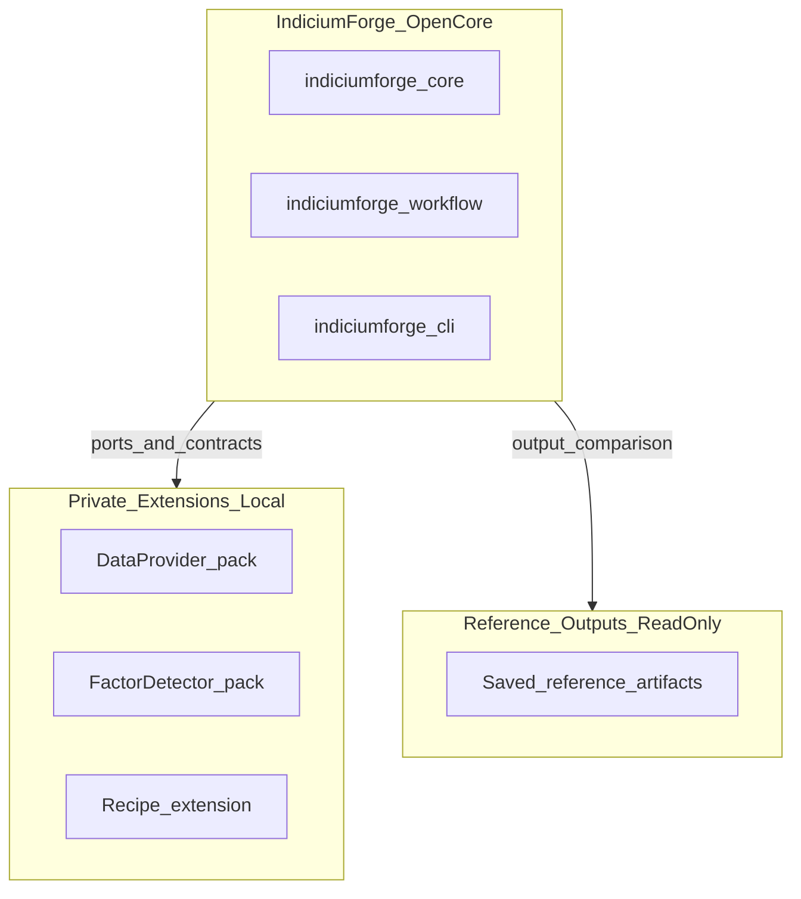
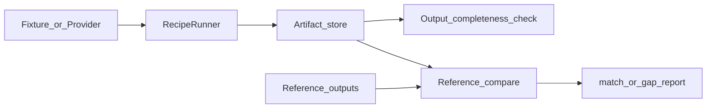
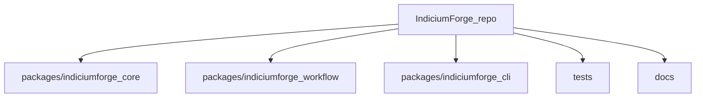

# IndiciumForge

[中文说明](README_CN.md)

**Open-core quantitative finance framework for reproducible financial research workflows.**

Licensed under [Apache License 2.0](LICENSE). **v2.0.1** — see [RELEASE_NOTES.md](RELEASE_NOTES.md).

> IndiciumForge standardizes workflow contracts, output artifacts, and extension boundaries. Default examples use **synthetic fixtures only**. Outputs are for **human research review**—not order routing or portfolio actions.

## What IndiciumForge is

IndiciumForge is an open-core quantitative finance framework for building reproducible financial research workflows. It helps you:

- **Define repeatable research workflow chains** (recipes and session stages)
- **Write auditable output artifacts** (JSON/CSV bundles with schema IDs)
- **Check output completeness** before deeper review (`artifact audit`)
- **Compare runs against reference outputs** when you refactor stages or extensions
- **Load private data, factor, and recipe extensions** via packs—without forking core contracts

IndiciumForge was extracted from an internal financial research workflow and generalized into an open-core toolkit.

New to the vocabulary? Start with [docs/GLOSSARY.md](docs/GLOSSARY.md).

## What IndiciumForge is not

- Not live trading, order routing, or portfolio management
- Not a substitute for compliance review or published research opinions
- Not a one-click “signals” product—outputs are workflow evidence for your team to interpret

## Who it is for

| Audience | Use case |
| --- | --- |
| Quant / research engineers | Run reproducible workflow chains with consistent outputs |
| Workflow authors | Define recipes and stage handoff formats |
| Extension authors | Ship private data/factor/recipe packs behind stable ports |
| Teams needing output governance | Audit artifact completeness and compare against references |

## 30-second Quickstart

Requirements: Python 3.10+.

```bash
cd <repo-root>
python -m pip install -e packages/indiciumforge-core -e packages/indiciumforge-workflow -e packages/indiciumforge-cli -e ".[dev]"
indiciumforge --help
indiciumforge workflow synthetic-e2e \
  --trade-date 2026-06-23 \
  --artifact-root /tmp/indiciumforge-demo \
  --daily-review-fixture tests/fixtures/market_awareness/theme_sectors_demo.yaml \
  --preopen-review-fixture tests/fixtures/workflow/preopen_buy_point_review_demo.csv
indiciumforge parity run \
  --parity-config tests/fixtures/parity_reference_demo/parity_config_demo.yaml \
  --artifact-root /tmp/indiciumforge-parity-demo
```

On Windows, use a writable temp directory (for example `%TEMP%\indiciumforge-demo`).

## Architecture

### System boundary



### Runtime data flow



### Package workspace



Deeper diagrams: [docs/SYSTEM_MAP.md](docs/SYSTEM_MAP.md), [docs/diagrams/context.md](docs/diagrams/context.md).

## Core capabilities

| Capability | What you get |
| --- | --- |
| Workflow CLI | `indiciumforge workflow ...` — synthetic e2e, chains, recipes |
| Output contracts | Schema-tagged JSON/CSV per stage |
| Output completeness | `indiciumforge artifact list/audit` |
| Reference comparison | `indiciumforge parity run` with demo fixtures |
| Extension packs | Provider, factor, and recipe entry points via YAML |
| OSS demos | Synthetic fixtures only—no live credentials in repo |
| Quant pipeline | `indiciumforge quant ...` — factor analytics, portfolio optimization, vectorized backtest, Black-Scholes pricing (W4) |

Full capability matrix: [CAPABILITY_REGISTER.md](CAPABILITY_REGISTER.md).

## Quant quickstart (W4)

IndiciumForge now ships real, tested quant capability behind `indiciumforge_core.quant`,
following the same port + pack-loading pattern:

| Capability | Port / adapter | Notes |
| --- | --- | --- |
| Factor analytics | `FactorAnalyticsPort` / `StatsmodelsFactorEngine` | Per-horizon Spearman IC, Fama-MacBeth slope + t-stat, turnover |
| Portfolio optimization | `PortfolioOptimizationPort` / `CvxpyOptimizer` | Mean-variance / min-variance, long-only, weight & sector caps |
| Backtest | `BacktestPort` / `VectorizedBacktester` | Pure numpy/pandas; prior-period weights (no look-ahead), flat cost, Sharpe/max-drawdown/Calmar |
| Option pricing | `PricingPort` / `BlackScholesPricer` | Analytic Black-Scholes European price + Greeks (stdlib only, no extra deps) |
| Data | `GoldenSnapshotProvider` / `AkshareDataProvider` | Committed synthetic A-share golden panel; akshare adapter behind `data` extra + offline `cache_only` |

The CLI exposes `indiciumforge quant` with `analytics` / `optimize` / `backtest` /
`price` / `pipeline` subcommands; heavy dependencies are imported lazily inside each
command, so the CLI loads even without the `analytics` / `portfolio` extras installed.

```bash
# End-to-end pipeline: factor -> analytics -> optimize -> backtest (deterministic, on the synthetic golden panel)
indiciumforge quant pipeline \
  --panel tests/fixtures/golden_ashare/panel.parquet --rebalance-every 10

# Analytic Black-Scholes European option price + Greeks
indiciumforge quant price \
  --spot 100 --strike 100 --maturity 1 --rate 0.05 --volatility 0.2 --type call
```

> The `analytics` / `optimize` / `backtest` subcommands accept pre-built CSVs (factor
> panel, returns panel, expected returns, covariance, weight history); `pipeline` starts
> from the OHLCV panel and is the out-of-the-box end-to-end demo.

> **Honesty note:** the W4 backtester is a daily, single-asset-return, cost-flat model
> with no slippage, market impact, or intraday dynamics; the demo runs on a **synthetic**
> golden panel, so all reported metrics demonstrate framework correctness, not market
> performance or live-trading backtests, and not investment advice (see
> [ADR-0026](docs/decisions/ADR-0026-quant-capability-increment.md)). QuantLib / rqalpha
> integration is out of scope for W4; the ports remain swappable for alternative adapters.

## Open core vs private extensions

**In this repository:** ports, schemas, demo fixtures, CLI, comparison harness, and author docs.

**Operator-local (not in OSS):** live data adapters, proprietary factor detectors, production recipe logic, credentials, and local reference trees.

Start here: [docs/EXTENSION_AUTHOR_GUIDE.md](docs/EXTENSION_AUTHOR_GUIDE.md) · [examples/private_extension_template/](examples/private_extension_template/)

## Documentation

### Users and extension authors

| Topic | Path |
| --- | --- |
| Glossary (start here) | [docs/GLOSSARY.md](docs/GLOSSARY.md) |
| Extension author guide | [docs/EXTENSION_AUTHOR_GUIDE.md](docs/EXTENSION_AUTHOR_GUIDE.md) |
| Extension template | [examples/private_extension_template/](examples/private_extension_template/) |
| OpenBB public demo plan | [docs/OPENBB_PUBLIC_DEMO_PLAN.md](docs/OPENBB_PUBLIC_DEMO_PLAN.md) |
| Workflow session model | [docs/WORKFLOW_SESSION_MODEL.md](docs/WORKFLOW_SESSION_MODEL.md) |
| Security | [SECURITY.md](SECURITY.md) |
| Release notes | [RELEASE_NOTES.md](RELEASE_NOTES.md) |

### Maintainer and contributor docs

| Topic | Path |
| --- | --- |
| System map | [docs/SYSTEM_MAP.md](docs/SYSTEM_MAP.md) |
| Capability register | [CAPABILITY_REGISTER.md](CAPABILITY_REGISTER.md) |
| Architecture decisions (ADRs) | [docs/decisions/](docs/decisions/) |
| Constitution | [INDICIUMFORGE_CONSTITUTION.md](INDICIUMFORGE_CONSTITUTION.md) |
| Migration roadmap | [docs/MIGRATION_ROADMAP.md](docs/MIGRATION_ROADMAP.md) |
| v1.0 definition | [docs/V1_0_DEFINITION.md](docs/V1_0_DEFINITION.md) |
| Agent onboarding | [docs/AGENT_QUICKSTART.md](docs/AGENT_QUICKSTART.md) · [AGENTS.md](AGENTS.md) |
| Agent skills | [agent/skills/](agent/skills/) |
| PyPI checklist | [docs/PYPI_RELEASE_CHECKLIST.md](docs/PYPI_RELEASE_CHECKLIST.md) |
| Paper draft | [docs/paper/INDICIUMFORGE_ARXIV_DRAFT.md](docs/paper/INDICIUMFORGE_ARXIV_DRAFT.md) |
| MCP / plugin design | [docs/mcp/](docs/mcp/) · [docs/plugin/](docs/plugin/) |

## Coming next: OpenBB public demo

**Planning only (not in v2.0.0):** a short public-data smoke workflow using OpenBB as an adapter example—one command, small deterministic artifact tree, no private paths.

Details: [docs/OPENBB_PUBLIC_DEMO_PLAN.md](docs/OPENBB_PUBLIC_DEMO_PLAN.md)

## Install

### PyPI (production)

Published on PyPI at **v2.0.1**:

```bash
pip install indiciumforge-cli==2.0.1
```

Install sibling packages explicitly if needed:

```bash
pip install indiciumforge-core==2.0.1 indiciumforge-workflow==2.0.1 indiciumforge-cli==2.0.1
```

| Package | PyPI | Install |
| --- | --- | --- |
| `indiciumforge-core` | [Published](https://pypi.org/project/indiciumforge-core/) | `pip install indiciumforge-core==2.0.1` |
| `indiciumforge-workflow` | [Published](https://pypi.org/project/indiciumforge-workflow/) | `pip install indiciumforge-workflow==2.0.1` |
| `indiciumforge-cli` | [Published](https://pypi.org/project/indiciumforge-cli/) | `pip install indiciumforge-cli==2.0.1` |

Release procedure: [docs/PYPI_RELEASE_CHECKLIST.md](docs/PYPI_RELEASE_CHECKLIST.md), [docs/TESTPYPI_RELEASE_RUNBOOK.md](docs/TESTPYPI_RELEASE_RUNBOOK.md).

### Install from source

```bash
cd <repo-root>
python -m pip install -e packages/indiciumforge-core
python -m pip install -e packages/indiciumforge-workflow
python -m pip install -e packages/indiciumforge-cli
python -m pip install -e ".[dev]"
```

The CLI entry point is `indiciumforge` (from `indiciumforge-cli`).

## Test

```bash
cd <repo-root>
python -m pytest -q
python -m ruff check .
```

On Windows, if pytest fails with Temp/.pytest_cache permission errors:

```powershell
python -m pytest -p no:cacheprovider -q --basetemp "$env:TEMP\indiciumforge_pytest\pytest-basetemp-<unique>"
```

| Layer | Path | Purpose |
| --- | --- | --- |
| Golden | `tests/golden/` | Semantic compare vs checked-in reference outputs |
| Contract | `tests/contract/` | Artifact store, providers, factors, workflow skeleton |
| Fixtures | `tests/fixtures/` | Synthetic OHLCV, recipes, parity demo trees |
| CLI smoke | `tests/cli/` | Typer help + workflow/artifact/parity commands |

## CLI reference

```powershell
indiciumforge --help
indiciumforge workflow market-gate --trade-date 2026-06-23 --artifact-root <artifact-root>
indiciumforge workflow chain --trade-date 2026-06-23 --artifact-root <artifact-root> \
  --daily-review-fixture tests/fixtures/market_awareness/theme_sectors_demo.yaml \
  --post-close-review-fixture tests/fixtures/workflow/post_close_buy_point_review_demo.csv \
  --preopen-review-fixture tests/fixtures/workflow/preopen_buy_point_review_demo.csv
indiciumforge artifact audit --artifact-root <artifact-root> --trade-date 2026-06-23 --stage-type market_gate
indiciumforge parity run --parity-config tests/fixtures/parity_reference_demo/parity_config_demo.yaml --artifact-root <artifact-root>
```

`artifact audit` checks structural completeness (required files, schema IDs, trade_date consistency). Semantic comparison uses the reference-comparison harness.

Expected inputs under `--artifact-root`:

```text
artifact-root/
  workflows/{YYYYMMDD}/preopen/buy_point_review_internal.csv
  market_awareness/{YYYYMMDD}/daily_review/theme_state_ranking.csv
```

Outputs: `artifact-root/workflows/{YYYYMMDD}/market_gate/` (strict, observation, active_watch, rejected, calibration, summary, state).

## Extended Quickstart

Full command walkthrough (chain, factor scan, recipe, provider):

```bash
indiciumforge workflow chain \
  --trade-date 2026-06-23 \
  --artifact-root /tmp/indiciumforge-chain \
  --daily-review-fixture tests/fixtures/market_awareness/theme_sectors_demo.yaml \
  --post-close-review-fixture tests/fixtures/workflow/post_close_buy_point_review_demo.csv \
  --preopen-review-fixture tests/fixtures/workflow/preopen_buy_point_review_demo.csv

indiciumforge factor scan \
  --trade-date 2026-05-10 \
  --artifact-root /tmp/indiciumforge-factor \
  --ohlcv-fixture-root tests/fixtures/ohlcv \
  --asset-fixture-list tests/fixtures/factor_scan_assets.yaml \
  --factor-pack tests/fixtures/factor_pack_demo.yaml

indiciumforge workflow chain \
  --trade-date 2026-06-23 \
  --artifact-root /tmp/indiciumforge-recipe \
  --recipe tests/fixtures/workflow/recipe_ashare_daily_v1.yaml \
  --recipe-extension-pack tests/fixtures/recipe_extension_pack_demo.yaml \
  --daily-review-fixture tests/fixtures/market_awareness/theme_sectors_demo.yaml

indiciumforge provider inspect --ohlcv-fixture-root tests/fixtures/ohlcv
```

## Packages

| Package | Role |
| --- | --- |
| `indiciumforge-core` | Domain, labels, ports, artifacts, providers, recipes, parity |
| `indiciumforge-workflow` | `market_gate` kernel; daily-review; e2e; workflow chain |
| `indiciumforge-cli` | `workflow`, `artifact`, `factor`, `provider`, `parity` commands |

## Maintainer notes

The sections below are for operators migrating from a legacy internal workflow or extending the signed v1.0 path. **New users can skip this.**

### Version boundaries

Per-release scope: [RELEASE_NOTES.md](RELEASE_NOTES.md), [CAPABILITY_REGISTER.md](CAPABILITY_REGISTER.md), [docs/V1_0_DEFINITION.md](docs/V1_0_DEFINITION.md).

### Migration and reference pin

Historical migration reconciliation: [docs/MIGRATION_ROADMAP.md](docs/MIGRATION_ROADMAP.md).

Frozen legacy reference label used by OSS golden fixtures (maintainer context only):

```text
indiciumgrid @ indiciumgrid-golden-v1
```

Golden export script (requires local frozen reference checkout):

```bash
python scripts/export_golden_market_gate.py
```

### Agent skills

| Skill | Purpose |
| --- | --- |
| [indiciumforge-orientation](agent/skills/indiciumforge-orientation/SKILL.md) | Onboard agents to repo layout and status docs |
| [indiciumforge-extension-author](agent/skills/indiciumforge-extension-author/SKILL.md) | Build private provider/factor/recipe packs |
| [indiciumforge-release-audit](agent/skills/indiciumforge-release-audit/SKILL.md) | Pre-release security and packaging checks |

Roadmap: [docs/AGENT_SKILL_ROADMAP.md](docs/AGENT_SKILL_ROADMAP.md).

### Technical paper draft

Markdown draft (not submitted to arXiv): [docs/paper/INDICIUMFORGE_ARXIV_DRAFT.md](docs/paper/INDICIUMFORGE_ARXIV_DRAFT.md) · [OUTLINE.md](docs/paper/OUTLINE.md) · [FIGURES.md](docs/paper/FIGURES.md)

### Future MCP and plugin surfaces

Design-only in v2.0.0: [docs/mcp/INDICIUMFORGE_MCP_DESIGN.md](docs/mcp/INDICIUMFORGE_MCP_DESIGN.md), [docs/plugin/INDICIUMFORGE_PLUGIN_DESIGN.md](docs/plugin/INDICIUMFORGE_PLUGIN_DESIGN.md), [docs/FUTURE_SURFACES.md](docs/FUTURE_SURFACES.md).
