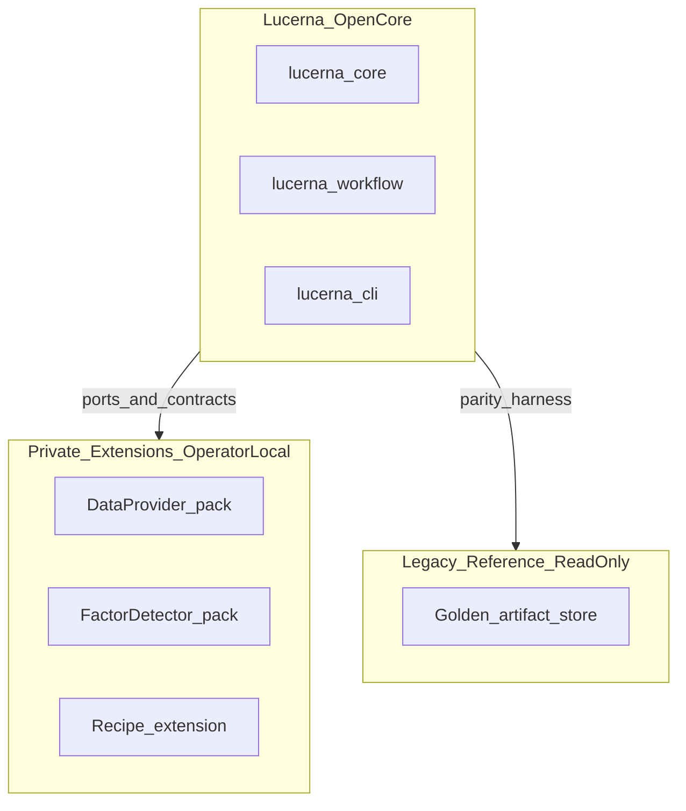
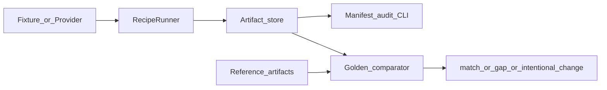
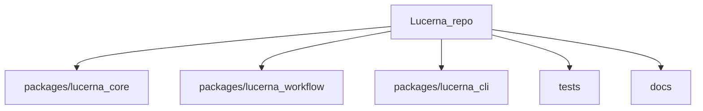

# System Map

High-level map of the Lucerna open-core workspace: packages, ports, artifacts, and parity.

## Packages

| Package | Path | Responsibility |
| --- | --- | --- |
| `lucerna-core` | `packages/lucerna_core/` | Domain types, ports, artifact I/O, recipes, parity, providers, factors |
| `lucerna-workflow` | `packages/lucerna_workflow/` | `market_gate` kernel, daily-review skeleton, e2e, workflow chain |
| `lucerna-cli` | `packages/lucerna_cli/` | Typer CLI: `workflow`, `artifact`, `factor`, `provider`, `parity` |

## Core ports

| Port | Schema / module | OSS implementation |
| --- | --- | --- |
| `DataProviderPort` v1 | `lucerna_core.providers` | `LocalFixtureProvider` + synthetic OHLCV |
| `DataProviderPortV2` | session-aware v2 | Pack loader + fixture/fake smoke |
| `FactorDetectorPort` | `lucerna_core.factors` | Demo detectors + pack loader boundary |
| Recipe extensions | `lucerna_core.recipes` | `RecipeRunner`, fake A-share extension in fixtures |
| Parity harness | `lucerna_core.parity` | Reference comparator + demo tree |

Workflows **never** import vendor modules directly — only ports and pack loaders.

## Artifact stages

```text
artifact-root/
  market_awareness/{YYYYMMDD}/daily_review/     # theme_state_ranking.csv, state JSON
  workflows/{YYYYMMDD}/
    post_close/                                   # review CSV + state
    preopen/                                      # review CSV + state
    market_gate/                                  # strict, observation, active_watch, ...
    workflow_chain_summary.json                   # chain metadata v1–v4
  factors/{YYYYMMDD}/                             # factor_scan artifacts (optional)
```

CLI audit: `lucerna artifact list/audit` for `market_gate` and `daily_review` stages.

## Parity dimensions

Config-driven via `lucerna.parity_local_config.v1`:

- `daily_review_structure`
- `post_close_handoff_shape`
- `preopen_handoff_shape`
- `market_gate_strict_semantics`
- `workflow_chain_summary_v4`

Verdicts: `match`, `intentional_change`, `unsupported_gap` — research audit only.

Demo: `tests/fixtures/parity_reference_demo/`.

## Diagrams

### System boundary



### Runtime data flow



### Package workspace



### Deeper architecture

- C4 context: [diagrams/context.md](diagrams/context.md)
- DFD level 0: [diagrams/dfd-level-0.md](diagrams/dfd-level-0.md)
- Session model: [WORKFLOW_SESSION_MODEL.md](WORKFLOW_SESSION_MODEL.md)
- ADR index: [decisions/](decisions/)

## Governance cross-links

| Document | Purpose |
| --- | --- |
| [CAPABILITY_REGISTER.md](../CAPABILITY_REGISTER.md) | Capability status matrix |
| [LUCERNA_CONSTITUTION.md](../LUCERNA_CONSTITUTION.md) | Non-negotiable principles |
| [MIGRATION_ROADMAP.md](MIGRATION_ROADMAP.md) | Forward schedule |
| [V1_0_DEFINITION.md](V1_0_DEFINITION.md) | v1.0 sign-off criteria |
