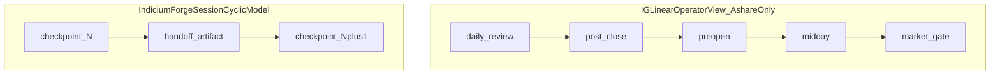

# Workflow Session Model

Normative reference for IndiciumForge session-cyclic workflow contracts (v0.8). See
[ADR-0018](decisions/ADR-0018-session-cyclic-workflow-model-v0.8.md).

## Core principle

- **Core** = session-cyclic orchestration contracts (`AssetDomain`, `SessionModel`,
  `WorkflowCheckpoint`, `HandoffArtifact`, `WorkflowRecipe`).
- **Recipes** = market-specific stage compositions (A-share daily, US handoff, crypto rolling).
- **IG folder names** (`post_close`, `preopen`, `midday`) are A-share **recipe compatibility
  labels**, not universal lifecycle enums.

## Linear vs cyclic

Global equities and crypto do not share one calendar `trade_date` folder semantics. They use
`cycle_id` and domain-specific checkpoints with explicit handoff artifacts.

## Core abstractions

| Type | Purpose |
| --- | --- |
| `AssetDomain` | Market/asset class (`china_a_share`, `us_equity`, `crypto_spot`, …) |
| `SessionModel` | Time advancement (`calendar_day_cycle`, `exchange_session_handoff`, `rolling_24x7`) |
| `WorkflowRecipe` | Named stage list + gates for one domain/session pair |
| `WorkflowCheckpoint` | One executed checkpoint (`checkpoint_id`, `cycle_id`, `recipe_stage_id`, …) |
| `EvidenceStageRef` | Artifact dir + schema ids for a checkpoint output |
| `HandoffArtifact` | Typed artifact contract between checkpoints |
| `Gate` | Policy filter (market_gate = A-share recipe gate, not the only gate) |
| `Review` | Human-facing review artifact family |

## A-share recipe: `indiciumforge.recipe.ashare_daily_research.v1`

Fixture: [tests/fixtures/workflow/recipe_ashare_daily_v1.yaml](../tests/fixtures/workflow/recipe_ashare_daily_v1.yaml)

| IG folder | Recipe stage id | Kind | Handoff |
| --- | --- | --- | --- |
| `market_awareness/.../daily_review` | `awareness_daily_review` | evidence | `theme_state_ranking` |
| `factor_scan` | `evidence_factor_scan` | evidence | `factor_scan_json` |
| `post_close` | `discovery_post_close` | discovery | `candidate_pool_raw` |
| `preopen` | `handoff_preopen` | handoff | `buy_point_review_internal` |
| `midday` | `refresh_midday_quotes` | refresh | `buy_point_review_internal` |
| `market_gate` | `gate_market_theme` | gate | gated candidate tables |

### IG implementation truth (read-only reference)

| Stage | Real semantic difference |
| --- | --- |
| `post_close` | Runs factor scan; builds candidate pool (discovery) |
| `preopen` | Reloads post_close candidates; rebuilds review (handoff) |
| `midday` | Quote refresh on inherited review (refresh) |
| `market_gate` | Theme gate; prefers preopen review, post_close fallback |

Shared review builder and identical artifact stems mean **folder names encode operator timing more
than domain type**.

## Global handoff example (contract only)

| Checkpoint | `cycle_id` example | Handoff artifact |
| --- | --- | --- |
| `us_close_summary` | `2026-06-23T20:00:00Z` | `us_close_candidates` |
| `asia_open_handoff` | `2026-06-24T01:00:00Z` | `asia_open_watchlist` |

Artifact layout (future): `workflows/{domain}/{cycle_id}/checkpoints/{checkpoint_id}/`

## Crypto 7x24 example (contract only)

- `SessionModel`: `rolling_24x7`
- `cycle_id`: window-start UTC timestamp or monotonic sequence
- Checkpoints: `rolling_evidence`, `rolling_review`, `derivatives_risk_review`
- Derivatives funding/leverage/liquidation/options risk: **separate evidence stage**, not folded
  into spot `Review` columns or market-gate kernel

## Data adapter dependency (v0.9)

Delivered in v0.9.0: `DataQuery` / `ProviderResult` carry session fields from checkpoints.
See [ADR-0020](decisions/ADR-0020-session-aware-data-provider-v2-v0.9.md).

Provider outputs should declare:

- `asset_domain`
- `checkpoint_id` / `recipe_stage_id` (via query/provenance)
- `cycle_id`
- `as_of`
- `ProviderAuthorityLevel` (fallback is not primary authority)
- compatible `HandoffArtifact` kind

Open-core CI uses fixture/fake providers only (`indiciumforge provider fetch`). Real adapters load via
private `indiciumforge.data_providers` entry points — see
[PRIVATE_DATA_ADAPTER_TEMPLATE.md](PRIVATE_DATA_ADAPTER_TEMPLATE.md).

## Recipe runner dependency (v0.10)

Delivered in v0.10.0: `RecipeRunner` loads recipe YAML, resolves handoff inputs, and dispatches
stages to `indiciumforge.recipe_extensions` entry points. Open-core handlers cover evidence and gate
stages; discovery/handoff require a private (or fake) extension. See
[ADR-0021](decisions/ADR-0021-ashare-private-recipe-integration-v0.10.md) and
[PRIVATE_ASHARE_RECIPE_TEMPLATE.md](PRIVATE_ASHARE_RECIPE_TEMPLATE.md).

Chain summary `workflow_chain_summary.v4` records recipe id, extension pack provenance, and per-stage
results. Skeleton chain (`workflow_chain_summary.v3`) remains available without `--recipe`.

## Golden test scope

A-share golden tests prove **compatibility** with frozen IG artifacts. They do **not** prove
universal workflow correctness for global or crypto domains.
