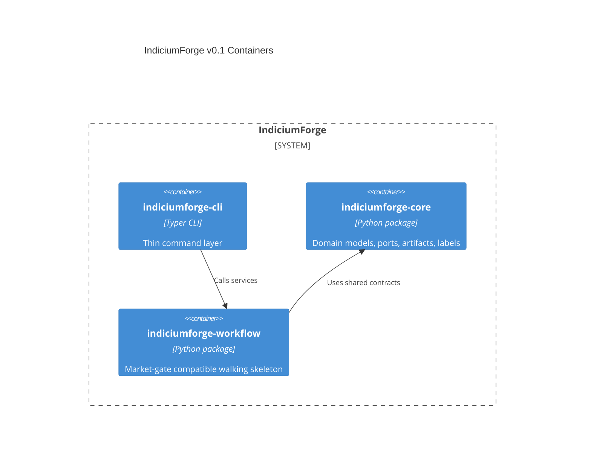

# IndiciumForge C4 Container

```mermaid
C4Container
title IndiciumForge v0.1 Containers
System_Boundary(indiciumforge, "IndiciumForge") {
  Container(cli, "indiciumforge-cli", "Typer CLI", "Thin command layer")
  Container(core, "indiciumforge-core", "Python package", "Domain models, ports, artifacts, labels")
  Container(workflow, "indiciumforge-workflow", "Python package", "Market-gate compatible walking skeleton")
}
Rel(cli, workflow, "Calls services")
Rel(workflow, core, "Uses shared contracts")
```
