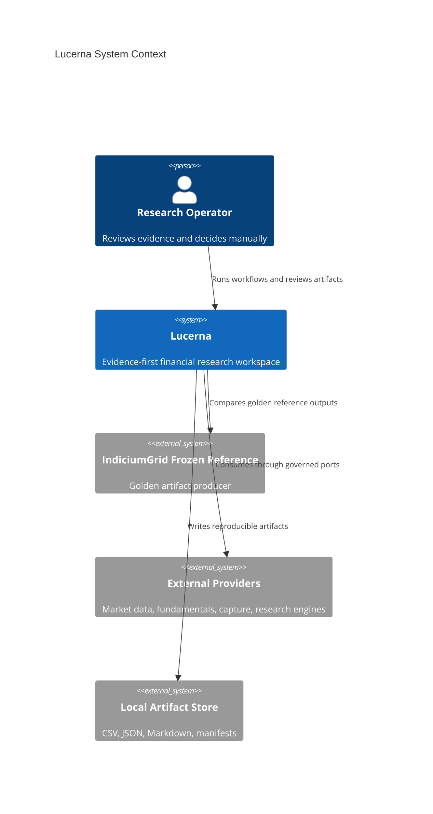

# Lucerna C4 Context

```mermaid
C4Context
title Lucerna System Context
Person(operator, "Research Operator", "Reviews evidence and decides manually")
System(lucerna, "Lucerna", "Evidence-first financial research workspace")
System_Ext(indiciumgrid, "IndiciumGrid Frozen Reference", "Golden artifact producer")
System_Ext(providers, "External Providers", "Market data, fundamentals, capture, research engines")
System_Ext(localfs, "Local Artifact Store", "CSV, JSON, Markdown, manifests")
Rel(operator, lucerna, "Runs workflows and reviews artifacts")
Rel(lucerna, indiciumgrid, "Compares golden reference outputs")
Rel(lucerna, providers, "Consumes through governed ports")
Rel(lucerna, localfs, "Writes reproducible artifacts")
```
