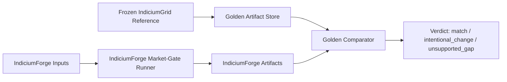

# DFD Level 0

```mermaid
flowchart LR
  A["Frozen IndiciumGrid Reference"] --> B["Golden Artifact Store"]
  C["IndiciumForge Inputs"] --> D["IndiciumForge Market-Gate Runner"]
  D --> E["IndiciumForge Artifacts"]
  B --> F["Golden Comparator"]
  E --> F
  F --> G["Verdict: match / intentional_change / unsupported_gap"]
```
