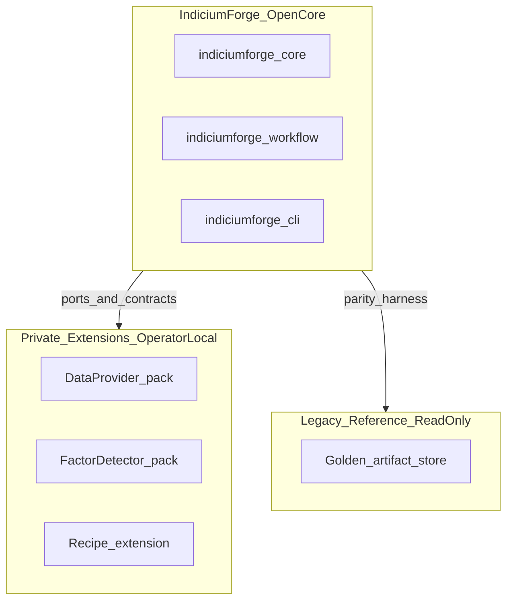
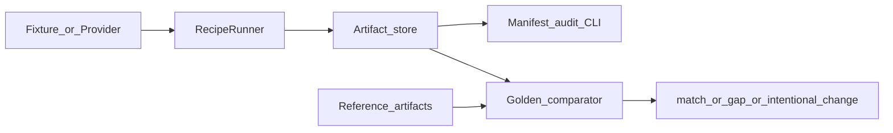
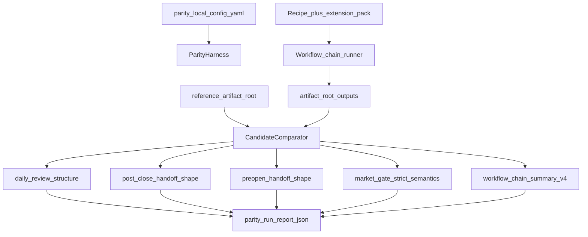
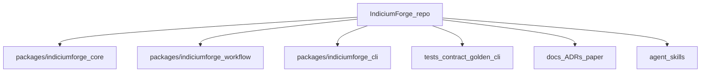
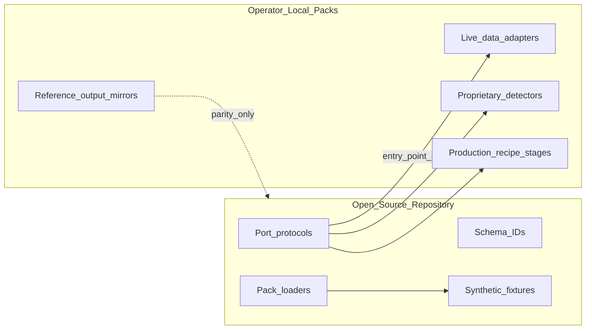
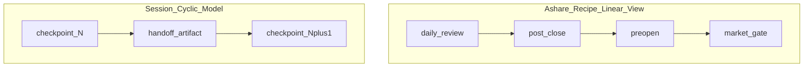

# Figures for IndiciumForge software paper

All diagrams describe **public OSS structure only**. No private data, account plots, or performance charts.

Render Mermaid for LaTeX via export or manual redraw. Figure numbers match suggested paper order.

---

## Figure 1 — System boundary

**Caption:** IndiciumForge open core exposes ports and contracts. Operator-local private extensions supply data, factors, and recipe logic. A frozen legacy reference supports parity comparison only—no runtime import of legacy code.

**Evidence:** README architecture Mermaid; ADR-0011; ADR-0019.

---

## Figure 2 — Runtime data flow

**Caption:** Research inputs flow through recipe runners into versioned artifacts. Manifest audit validates structure; golden and parity comparators evaluate semantics against reference trees.

**Evidence:** README; `indiciumforge artifact audit`; `tests/golden/test_market_gate.py`.

---

## Figure 3 — Artifact parity flow

**Caption:** Parity harness loads operator config, runs recipe chain into `artifact_root`, compares five dimensions against `reference_artifact_root`, and emits `parity_run_report.json` with per-dimension verdicts.

**Evidence:** ADR-0022; `indiciumforge_core.parity`; `tests/fixtures/parity_reference_demo/`.

---

## Figure 4 — Package workspace map

**Caption:** Monorepo layout: three installable Python packages, contract tests, golden fixtures, and governance docs.

**Evidence:** `packages/indiciumforge-{core,workflow,cli}/`; `pyproject.toml` files; tag `v2.0.0`.

---

## Figure 5 — Extension boundary

**Caption:** Open core ships port interfaces, schema contracts, loaders, and synthetic demos. Private packs implement proprietary logic behind entry points—never committed to the public repository.

**Evidence:** ADR-0011; EXTENSION_AUTHOR_GUIDE.md; `examples/private_extension_template/`.

---

## Figure 6 — Workflow session model (optional)

**Caption:** IndiciumForge session-cyclic model generalizes linear A-share operator folders via checkpoints and handoff artifacts.

**Evidence:** ADR-0018; docs/WORKFLOW_SESSION_MODEL.md.

---

## Not included

| Item | Reason |
| --- | --- |
| Performance / backtest charts | No reproducible experiment dataset in OSS |
| Account / portfolio screenshots | ADR-0011 boundary |
| Private parity row dumps | Confidential; verdict categories only in paper |
| Competition / contest workflows | Out of scope |

## LaTeX rendering notes

- Prefer vector figures; keep monospace schema IDs readable
- Caption must repeat research-audit disclaimer where parity figures appear
- Cross-reference CLAIMS_REGISTER figure-related claims (F1–F6)
